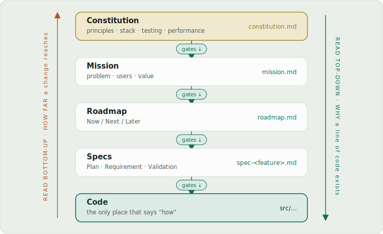

# source-of-truth

[](./LICENSE)


### Stop your AI from silently deleting features it doesn't know exist.

source-of-truth gives your coding agent a persistent memory: it reads what already exists **before** writing code, and updates the record **after** a feature ships — so it stops rebuilding, deleting, and breaking things it never knew were there.

**One skill, every coding agent** — Claude Code · Codex · Cursor · Gemini · Copilot · Kimi · OpenCode · Pi. → [Install](#installation)

Under the hood it's a self-maintaining **Spec-Driven Development (SDD)** catalog skill: a `docs/` folder that acts as the project's source of truth for *what exists, why it exists, and what rules apply*.

> The **catalog** is the source of truth for "what exists, why, and what rules apply".
> The **code** is the source of truth for "how it works".

<p align="center">
  
</p>

See the [live explainer](https://ngocquang.github.io/source-of-truth/explainer/) for the full visual walkthrough of the workflow.

---

## Works well with

Source-of-Truth is a *catalog* skill, not a workflow engine — it's designed to sit alongside a development methodology, not replace one. Pairing it with one of these is a great fit:

- **[superpowers](https://github.com/obra/superpowers)** drives *how* you work (brainstorming → planning → TDD → review). Source-of-Truth keeps the persistent record of *what* exists and *why*, so each superpowers cycle reads the catalog before coding and syncs it after shipping.
- **[spec-kit](https://github.com/github/spec-kit)** generates specs and plans up front for a feature. Source-of-Truth turns those one-off specs into a living catalog that stays in sync with the code as the project evolves.

In short: the methodology produces the work; Source-of-Truth keeps the source of truth honest across sessions.

---

## Quickstart (Claude Code)

> Using Codex, Cursor, Gemini, Copilot, Kimi, OpenCode, or Pi instead? Skip to [Installation](#installation) for the per-platform steps — the skill itself is identical everywhere.

**1. Install the plugin, then reload so the skill activates:**

```bash
/plugin marketplace add ngocquang/source-of-truth
```

```bash
/plugin install source-of-truth@source-of-truth-dev
```

```bash
/reload-plugins
```

**2. Have a PRD or SDD ready first.** The catalog is built *from* your intent, not guessed from scratch — so before you run anything, have a Product Requirements Document (PRD) or Software Design Document (SDD) on hand, even a rough one. Already ran **[superpowers](https://github.com/obra/superpowers)** or **[spec-kit](https://github.com/github/spec-kit)** for the feature? Their specs and plans count too. Bootstrap pulls whatever you have in as the **primary source of feature intent and mission** (code shows *how*; the doc shows *why*).

**3. Then just type `/source-of-truth`.** That's the whole trigger. It reads your PRD/SDD, bootstraps the `docs/` catalog, and from then on activates on its own — READ before each change, SYNC after each ship.

Using another agent (Codex, Cursor, Gemini, Copilot, Kimi, OpenCode, Pi)? See [Installation](#installation) for per-platform steps.

---

## Why it exists

When an AI edits a codebase with no reference source, four failures recur:

1. **Rebuilding** a feature that already exists.
2. **Silently deleting** features during a refactor.
3. **Breaking invariants** by changing behavior without knowing the contract.
4. **Building features** that violate project principles or aren't on the roadmap.

The catalog is the reference that blocks all four — read before code is written, kept in sync after it ships.

---

## How it works

The catalog enforces a **gate chain** — each layer authorizes the one below it:

**constitution → mission → roadmap → specs → code**

Principles gate plans → mission gates the roadmap → the roadmap gates specs → specs gate code. Read top-down to learn *why* a line of code exists; nothing reaches code until the layer above permits it.

It all lives in a `docs/` folder of plain, greppable markdown:

- **`overview.md`** — index linking every project doc and feature spec.
- **`constitution.md`** — principles: tech stack, code quality, testing, UX, performance.
- **`mission.md`** — why the project exists: problem, users, value, success metrics.
- **`roadmap.md`** — forward plan (Now / Next / Later); shipped work leaves it.
- **`CHANGELOG.md`** — removals, renames, contract changes, constitution changes.
- **`specs/spec-<feature>.md`** — one file per feature: Plan + Requirement + Validation.

The **catalog** owns *what exists & why*; the **code** owns *how it works*. Exact schemas live in the skill's `references/`.

---

## Installation

Installation differs by agent. If you use more than one, install source-of-truth separately for each. The skill is identical across them — each platform just needs to discover the `skills/` directory, then it activates automatically when a task touches a `docs/` spec catalog.

### Claude Code

Register the marketplace shipped in this repo:

```bash
/plugin marketplace add ngocquang/source-of-truth
```

Then install the plugin:

```bash
/plugin install source-of-truth@source-of-truth-dev
```

Update later:

```bash
/plugin marketplace update source-of-truth-dev
```

### Codex

Codex reads [`.codex-plugin/plugin.json`](./.codex-plugin/plugin.json), which registers `./skills/`. Point Codex's plugin manager at this repository (or a local clone) to install it.

### Cursor

Cursor reads [`.cursor-plugin/plugin.json`](./.cursor-plugin/plugin.json), which registers `./skills/`. Install it from this repository (or a local clone) via Cursor's plugin manager.

### Gemini CLI

Install the extension from this repository:

```bash
gemini extensions install https://github.com/ngocquang/source-of-truth
```

Update later:

```bash
gemini extensions update source-of-truth
```

Gemini loads [`GEMINI.md`](./GEMINI.md), which imports the skill so it's active from the first message.

### GitHub Copilot CLI

Copilot reads the same marketplace as Claude Code. Register it, then install:

```bash
copilot plugin marketplace add ngocquang/source-of-truth
copilot plugin install source-of-truth@source-of-truth-dev
```

### Kimi Code

Install directly from this repository:

```text
/plugins install https://github.com/ngocquang/source-of-truth
```

### OpenCode

Tell OpenCode to follow the bundled install guide:

```text
Fetch and follow instructions from https://raw.githubusercontent.com/ngocquang/source-of-truth/main/.opencode/INSTALL.md
```

Or add it to your `opencode.json` directly:

```json
{
  "plugin": ["source-of-truth@git+https://github.com/ngocquang/source-of-truth.git"]
}
```

### Pi

Install source-of-truth as a Pi package from this repository:

```bash
pi install git:github.com/ngocquang/source-of-truth
```

The package loads the skill via the [`.pi/extensions/source-of-truth.ts`](./.pi/extensions/source-of-truth.ts) extension's `resources_discover` hook.

---

## The Basic Workflow

You don't invoke the skill manually — it activates on context. The whole loop is **bootstrap once → READ before each change → SYNC after each ship**:

1. **First time in a project — bootstrap the catalog (once).** Ask *"set up the source-of-truth catalog"*. The skill auto-detects your stack, asks a single batch of questions (principles, mission), and writes `docs/` after you confirm. Skip this if `docs/overview.md` already exists.
2. **Ask for a change as usual.** Before writing any code the skill enters **READ**: it loads the catalog and prints a **Catalog check** (what exists, invariants, roadmap status, conflicts) for you to review.
3. **Resolve conflicts, then approve.** If the change collides with an existing feature, a documented invariant, the constitution, or isn't on the roadmap, the skill **stops and asks**. Add a roadmap entry or adjust the plan, then let it proceed.
4. **Implement.** The skill writes code against the approved plan and the documented contracts.
5. **Ship / commit.** Say *"done"*, *"commit"*, or *"merge"*. The skill enters **SYNC**: it reads the diff, updates the affected specs, moves shipped items off the roadmap, records removals/renames in the CHANGELOG, shows you the catalog diff, then commits code and catalog together.

The catalog stays true to the code with no separate "update the docs" step — READ and SYNC are the only two touchpoints you need to remember.

---

## What's Inside

The skill operates in three modes, selected automatically by context:

| Mode | When | What happens |
|---|---|---|
| **BOOTSTRAP** | `docs/overview.md` does NOT exist + project has code | Auto-detect stack → interview user for principles/mission → confirm & write the catalog. Runs once. |
| **READ** | Before writing / modifying / deleting code (incl. bug fixes, refactors, "does X already exist?") | Load catalog, output a **Catalog check** to the user, stop on conflicts, only then write code. |
| **SYNC** | A feature shipped ("ship it", "done", "commit", "merge", "xong rồi") or "update/sync the catalog" | Reconcile catalog with the diff: update specs, remove shipped entries from the roadmap, record deletions/renames in CHANGELOG. |

**RE-BOOTSTRAP**: a special case of BOOTSTRAP — when `docs/overview.md` exists but `constitution.md` or `mission.md` is missing/empty, re-bootstrap the missing file before any code change.

**Commit gate**: a commit request is itself a SYNC trigger. When you ask to commit (or the agent is about to), SYNC runs and **completes before the commit** — so the code and the catalog are committed together. This is automatic, not a question.

Ambiguous? Ask once: *"Sync the catalog now, or keep going?"*

### READ mode — the Catalog check

Before any code is written, the skill prints this to the user (so it can be overridden):

```
Catalog check:
- Constitution: <relevant principle, or "no conflict">
- Roadmap status: <Now | Next | Later | shipped (off-roadmap) | NOT TRACKED>
- Related existing features: <list, or "none found">
- Invariants I must preserve: <list, or "none">
- Acceptance criteria that must still pass: <list, or "none">
- Already exists? <yes + which feature, or no>
- Plan: <what I'm about to do and why it doesn't conflict>
```

If the change collides with an existing feature, a documented invariant, a constitution principle, or the roadmap — the skill **stops and asks** instead of proceeding.

### SYNC mode — after shipping

SYNC reconciles the catalog with what changed: it reads the diff (`git diff --name-only`, current commit, date), updates the affected specs, moves shipped roadmap entries off `Now`, and records removals / renames / contract changes in the CHANGELOG. Full procedure lives in the skill's `references/`.

### BOOTSTRAP mode — three phases

- **A — Auto-detect** (no user input): scan repo for tech stack, test framework, design system, README intro, and feature entry points.
- **B — Interview** (single batch): ask only what can't be detected (code-quality rules, performance budgets, mission users/value/metrics).
- **C — Confirm & write**: show populated docs, get OK, then write all 5 project docs, including CHANGELOG, plus per-feature specs, and update CLAUDE.md.

`constitution.md` and `mission.md` must have real content before bootstrap completes — `_TBD: <question>_` markers are acceptable for deferred sections, but blank fields and fabricated content are not.

---

## Philosophy

Source-of-Truth is **rigid, not advisory** — its value comes from being followed exactly:

- **Read before you write; sync after you ship.** Don't skip a mode or shortcut the Catalog check to "save time" — small changes break invariants most often.
- **Every unit of work goes on the roadmap.** New feature, enhancement, refactor, *and bug fix* — each gets a `roadmap.md` entry before code is written. The rule blocks the agent's own "too small to track" rationalizing; an explicit user override (e.g. a live hotfix) is honored, with a recommended retroactive entry.
- **Never fabricate.** If it isn't visible in code, tests, or stated by the user, don't assert it — tests are the best source of invariants; the user is the only source of mission and code-quality principles. A vague invariant is worse than none.
- **The catalog owns *what & why*; the code owns *how*.** The two never compete for the same truth.

---

## Contributing

Issues and pull requests are welcome at [github.com/ngocquang/source-of-truth](https://github.com/ngocquang/source-of-truth). The skill itself lives in `skills/source-of-truth/` — `SKILL.md` is the entry point, with `references/` for the detailed BOOTSTRAP / SYNC / CHANGELOG procedures. Edit there and the change reaches every supported agent.

---

## License

MIT © QuangDN. See the plugin metadata in [`.claude-plugin/plugin.json`](./.claude-plugin/plugin.json).

---

## Community

Questions, ideas, or bugs? Open an issue or start a discussion on [GitHub](https://github.com/ngocquang/source-of-truth).
